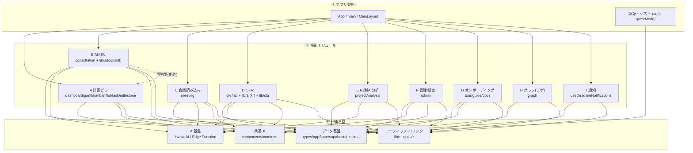

# モジュール地図（task_manage）

> **このアプリを「領域（モジュール）」で分けて保守するための地図です。**
> バグ探し・リファクタ・機能追加のときは、まず「どのモジュールの話か」をここで特定し、
> **そのモジュールのファイル群だけ**を読む／直すようにします（毎回全コードを読まないため）。
>
> 設計の考え方：**関心の分離（Separation of Concerns）＋ モジュール化**。
> 業務領域ごとに境界を引く＝**ドメイン駆動設計（DDD）／モジュラーモノリス**。
> 目標は **高凝集・低結合**（1モジュールの中身は関連が強く、モジュール間の依存は弱く）。
>
> 最終更新：2026-06-03（初版）。機能追加のたびに更新すること。

---

## 1. 全体像（3層）

```
┌────────────────────────────────────────────────────────────────────┐
│  ① アプリ骨格 (App Shell)                                           │
│     App / main / MainLayout / 認証(ログイン・ゲスト・初期設定)      │
│     └ 各「機能モジュール」を配置・切替し、共通基盤に接続するだけ    │
└───────────────────────────────┬────────────────────────────────────┘
                                │ 機能を載せる
┌───────────────────────────────┴────────────────────────────────────┐
│  ② 機能モジュール (Features) — 業務領域ごと                         │
│   A 計画ビュー   B AI相談   C 会議読み込み   D OKR                  │
│   E PJ別AI分析   F 管理/設定  G オンボーディング  H グラフ  I 通知   │
│   ※ 機能どうしは原則 直接依存しない（連携はデータ基盤を介す）       │
└───────────────────────────────┬────────────────────────────────────┘
                                │ すべて下の土台に乗る（依存は下向きのみ）
┌───────────────────────────────┴────────────────────────────────────┐
│  ③ 共通基盤 (Foundation)                                            │
│   ・データ基盤 : 型 / Supabase / appStore(単一の真実) / Realtime    │
│   ・AI基盤     : invokeAI(唯一のゲート) / Edge Function             │
│   ・共通UI     : ボタン・モーダル・トースト・セレクト 等            │
│   ・ユーティリティ : 日付 / エラー / 統計 / 権限(guestMode) / hooks  │
└────────────────────────────────────────────────────────────────────┘
```

### 依存の向き（重要ルール）
- **上の層 → 下の層**：OK（機能は基盤を使ってよい）。
- **下の層 → 上の層**：禁止（基盤・共通UIは特定機能を知らない）。
- **機能 ↔ 機能**：原則しない。連携は **データ基盤（appStore）を介す**。
  - 既知の例外：AI相談の「ガントで比較（GanttPreviewPanel）」は計画ビューの `GanttView` を再利用している。

---

## 2. 依存関係図（Mermaid）



---

## 3. モジュール一覧（責務 / 主なファイル / 改修の入口）

### ① アプリ骨格 (App Shell)
| モジュール | 責務 | 主なファイル |
|---|---|---|
| **App Shell** | 起動・ログイン状態・画面切替・全体レイアウト・FAB | `src/App.tsx` / `src/main.tsx` / `components/layout/MainLayout.tsx` |
| **認証・入口** | メンバー選択 / ゲスト(閲覧のみ) / 初期セットアップ | `components/auth/{LoginScreen,UserSelectScreen,SetupWizard}.tsx` / `lib/guestMode.ts` |

### ② 機能モジュール (Features)
| # | モジュール | 責務（バグ探しの入口） | 主なファイル | 主な依存 |
|---|---|---|---|---|
| **A** | **計画ビュー** | PJ・タスク・マイルストーンの閲覧/編集（ダッシュボード/ガント/カンバン/リスト/タスク編集/マイルストーン） | `components/dashboard/*` / `gantt/GanttView` / `kanban/KanbanView` / `list/ListView` / `task/{TaskEditModal,QuickAddTaskModal,TaskSidePanel}` / `milestone/*` | データ基盤, 共通UI, `lib/okr`, `lib/taskHierarchy` |
| **B** | **AI相談** | チャットで相談 / PJ・タスク登録 / タスク階層化 / 提案の反映・Undo | `components/consultation/*` / `hooks/useAIConsultation` / `stores/consultSessionStore` / `lib/ai/{payloadBuilder,systemPrompt,responseParser,proposalMapper,applyProposal,inferConsultationType,sessionManager,undoApply,chatHistoryStorage}` / `hooks/useUndoStack` | AI基盤, データ基盤, （例外）A |
| **C** | **会議読み込み** | 議事メモ/VTT/Word/PDFからタスク抽出→登録 | `components/meeting/MeetingImportPanel` / `lib/ai/meetingExtractor` / `lib/docxText` | AI基盤, データ基盤 |
| **D** | **OKR** | 週次サイクル（①会議ノート→②セッション&分析→③レポート）/ なぜなぜ / クォーター計画 | `components/okr/*` / `components/lab/{KrJointSessionFlow,KrReportPanel,KrWhyPanel,KrQuarterPlanPanel}` / `lib/ai/{krSessionExtractor,krReportClient,krReportPrompt,krWhyClient,krQuarterPlanClient,krQuarterPlanPrompt,okrKrAnalysisClient,okrObjectiveAnalysisClient}` / `lib/supabase/{krSessionStore,krMeetingNoteStore,krReportStore,okrAnalysisStore,quarterPlanStore}` / `lib/okr/*` | AI基盤, データ基盤 |
| **E** | **PJ別AI分析** | 1つのPJの健全性をAI分析（プロジェクトカルテから起動） | `lib/ai/projectAnalysisClient` / `lib/supabase/projectAnalysisStore`（UIは `dashboard/ProjectKarte`） | AI基盤, データ基盤 |
| **F** | **管理・設定** | メンバー/Objective/KR/TF/PJ/タグ/AI使用量の管理・ToDo分解 | `components/admin/{AdminView,TodoDecomposeModal}` / `lib/ai/todoDecomposeClient` | データ基盤, AI基盤 |
| **G** | **オンボーディング** | ツアー / 📖ガイド / `?`ヘルプ（docs/guides を表示） | `components/tour/*` / `components/guide/*` / `lib/docs/*` / `docs/guides/**` | 共通UI, データ基盤 |
| **H** | **グラフ（ラボ）** | 関係性グラフの可視化（Canvas物理シミュ） | `components/graph/GraphView` | データ基盤 |
| **I** | **通知** | 期限のブラウザ通知 / Teamsまとめ（Edge） | `hooks/useDeadlineNotifications` / `supabase/functions/notify-deadlines` | データ基盤 |

### ③ 共通基盤 (Foundation)
| モジュール | 責務 | 主なファイル |
|---|---|---|
| **データ基盤** | 全データの単一の真実・永続化・競合制御・リアルタイム反映 | `lib/localData/{types,localStore}` / `stores/appStore` / `context/AppDataContext` / `lib/supabase/{client,store,realtime,auth}` ＋ エンティティ別store群 |
| **AI基盤** | AI呼び出しの唯一のゲート＋使用量計上（APIキーはEdgeのみ） | `lib/ai/{invokeAI,apiClient,usageLog,sanitize,types}` / `supabase/functions/ai-consult`（Edge） |
| **共通UI** | 横断的に使うUI部品 | `components/common/*`（Toast, ConfirmModal, CustomSelect, MarkdownLite, ErrorBoundary, EmptyState, AIProgressLoader, FileAttachButton, ...） |
| **ユーティリティ/フック** | 日付・エラー整形・統計・タスク派生・権限(guestMode)・汎用hooks | `lib/{date,errorMessage,errorReporter,stats,taskMeta,taskHierarchy,htmlText,docxText,renderLinks,lazyWithRetry,dialog,guestMode}` / `hooks/{useIsMobile,useTheme,useTypingEffect,useUndoStack}` |

---

## 4. この地図の使い方

### バグ探し・改修のとき
1. **症状からモジュールを特定**（例：「ガントにタスクが出ない」→ A 計画ビュー、「AI反映が失敗」→ B AI相談＋データ基盤）。
2. そのモジュールの**主なファイルだけ**を読む。足りなければ「主な依存」をたどって基盤へ降りる。
3. 直すのは**できるだけそのモジュール内**で。基盤（共通UI/データ基盤）を触るときは**全機能に波及**する前提で慎重に。

### AI（Claude Code等）に頼むとき
- 「これは **B AI相談モジュール** の話。`components/consultation` と `lib/ai`(consult系) を見て」のように**範囲を指定**すると、無駄に全部読まずに済む。

### 機能を足すとき
- まず「既存モジュールの一部か、新モジュールか」を決める → この地図に1行追加 → 依存の向き（下向きのみ）を守る。

---

## 5. 各モジュールの README（2026-06-03 設置済み）
主要モジュールの入口フォルダに、責務・主なファイル・注意点をまとめた `README.md` を置いた。
**改修・バグ探しは、まず本地図でモジュールを特定 → そのフォルダの README → 必要なファイル、の順で読む。**

| モジュール | README |
|---|---|
| B AI相談 | `src/components/consultation/README.md` |
| C 会議読み込み | `src/components/meeting/README.md` |
| D OKR | `src/components/okr/README.md` |
| F 管理/設定 | `src/components/admin/README.md` |
| G オンボーディング | `src/components/tour/README.md` |
| H グラフ | `src/components/graph/README.md` |
| A 計画ビュー（概要） | `src/components/dashboard/README.md` |
| A タスク編集 / マイルストーン | `src/components/task/README.md` / `src/components/milestone/README.md` |
| 共通基盤：AI基盤 | `src/lib/ai/README.md` |
| 共通基盤：データ永続化 | `src/lib/supabase/README.md` |
| 共通基盤：状態管理 | `src/stores/README.md` |

※ E PJ別AI分析・I 通知 は lib/hook 中心の小モジュールのため、本地図と上記READMEで参照（専用READMEなし）。

## 6. さらに先（任意・未実施）
- **Package by Feature** へのフォルダ再編（例：`features/consultation/` に UI・hook・lib をまとめる）。※ import 大量変更を伴うため、やるなら段階的に。
- `CLAUDE.md`（設計の正本・v2.19）と本地図・各README はセットで維持する（機能追加のたびに更新）。
